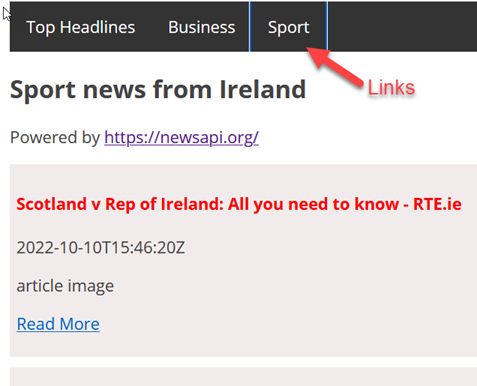
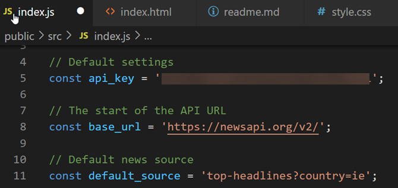
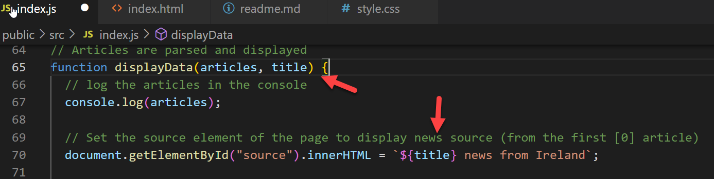
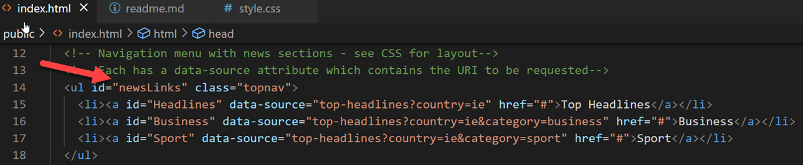
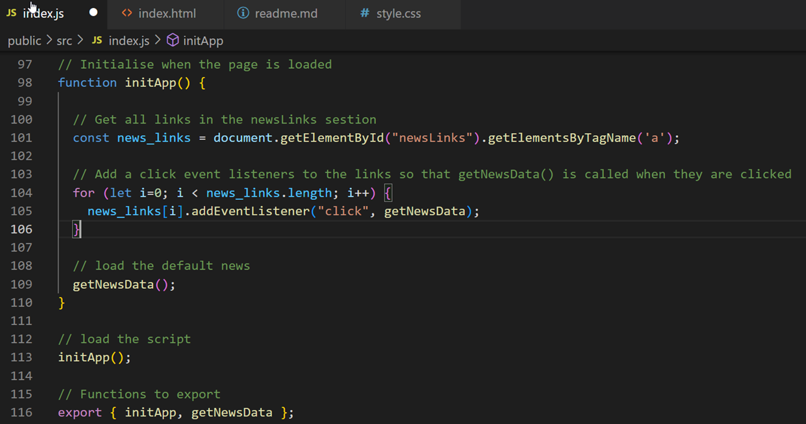
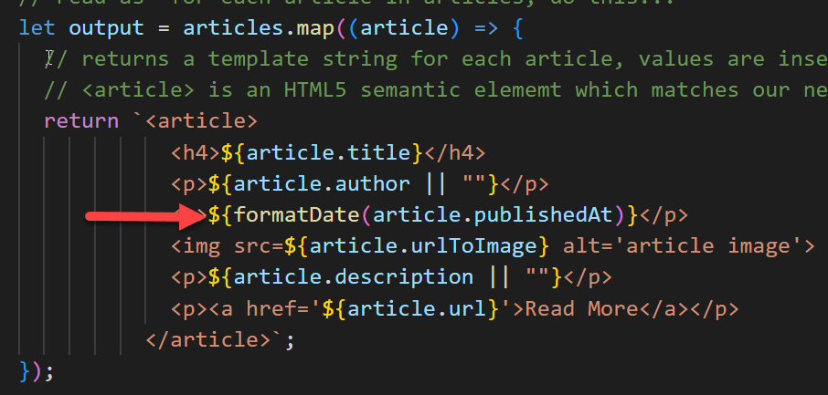

# News API Exercise - Example Solution


### 1. Show news stories from several different newsapi.org sources, with menus and links for navigation.


##### 1.1. Example menu with three news links:




Here is the HTML. Clicking these links will call a the **```getNewsData()```** function. Note that each link has an **```id```** and **```data-source```** attribute. The values of these can be accessed by **```getNewsData()```** 

```html
  <!-- Navigation menu with news sections - see CSS for layout-->
  <!-- Each has a data-source attribute which contains the URI to be requested-->
  <ul id="newsLinks" class="topnav">
    <li><a id="Headlines" data-source="top-headlines?country=ie" href="#">Top Headlines</a></li>
    <li><a id="Business" data-source="top-headlines?country=ie&category=business" href="#">Business</a></li>
    <li><a id="Sport" data-source="top-headlines?country=ie&category=sport" href="#">Sport</a></li>
  </ul>
```

The menu layout is defined in  **```style.css```**.


 ##### 1.2. Modify **```getNewsData()```** to load news when a link is clicked

First define  some setting variables, including the **```base_url```** of the API and a default news source. These are based on the [newsapi.org](https://newsapi.org/) documentation and examples.





The **```getNewsData()```** function gets the news source and title when one of the links is clicked. **```this```** represents the object that was clicked so that **```this.data.source```** is used to access  the **```data-source```** attribute value set in **index.html**.

```javascript
// Asynchronous Function to call API and get data
// note parameter value default (in case it is missing)
async function getNewsData() {

  // set the defaults
  let news_source = default_source;
  let news_title = "Headlines";

  // 'this' is set when this function is called via an event (clicking on the section links)
  // if it exists then read the data-source and link id
  if (this) {
    news_source = this.dataset.source;
    news_title = this.id;
  }

  // generate the url 
  const url = `${base_url}${news_source}&apiKey=${api_key}`;

  console.log(url);

  // fetch the data
  try {
    // call the api - await indicates an async call
    // this call is non blocking and will return a promise
    const response = await fetch(url, req_init);

    // get json data from the response - when it arrives
    const json = await response.json();

    // log raw json result
    console.log(json);

    // display the articles and pass the title
    displayData(json.articles, news_title);

    // catch any errors
  } catch (err) {
    console.log(err);
  }
}
```


##### 1.3. Modify **```displayData()```** to show the source title

Modify the function  to accept **```title```** as a parameter and then display it.




##### 1.4 Add event listeners to the links

The menu news links do not link to other web pages. Instead, the **```getNewData()```** function should be called when they are clicked.

The first step is to get all the elements with an ```a``` tag in the ```newsLinks``` nav menu. 




Then use a for loop to iterate through the array, adding an event listener to each  element so that ```getNewsData()``` is called when a link is clicked




### 2. Date Formatting

This function accepts a date in string format and converts it to the required format

```javascript
// see https://dockyard.com/blog/2020/02/14/you-probably-don-t-need-moment-js-anymore
function formatDate(d) {
  return new Date(d).toLocaleDateString(
    'en-ie',
    {
      year: 'numeric',
      month: 'long',
      day: 'numeric',
      hour: 'numeric',
      minute: 'numeric'
    }
  );
}
```


calling the function in ```displayData()```



